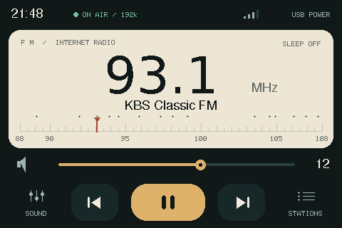
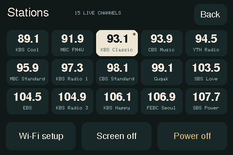
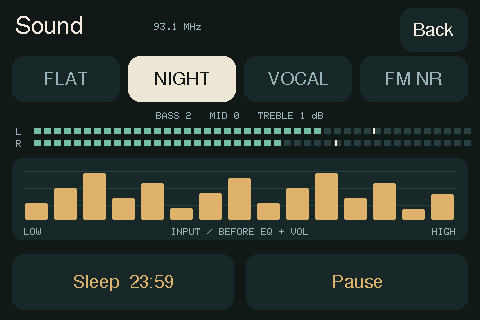

# ESP32-S3 / ESP32-P4 인터넷 FM 라디오

ESP32 보드로 만든 한국 FM 라디오. **보드 세 종류**를 한 저장소에서 빌드한다.

| 보드 | 화면 | PlatformIO env | 특징 |
|---|---|---|---|
| Waveshare **ESP32-S3-ePaper-1.54** | ePaper 200×200 | `epaper` | 전원을 끊어도 그림이 남아 시계 모드가 성립 |
| M5Stack **M5StickS3** | LCD 240×135 | `sticks3` | 손목시계처럼 — 평소 화면 끄고 집어 들면 켜짐 |
| Waveshare **ESP32-P4-WIFI6-Touch-LCD-3.5** | 터치 LCD 480×320 | `p4` | 버튼 없이 화면을 눌러 조작. Wi-Fi 는 옆의 ESP32-C6 |

앞의 둘은 MCU(ESP32-S3-PICO-1-N8R8)가 같고, 셋 다 오디오 코덱이 ES8311 이라
스트리밍·선국·채널 목록은 그대로 공유한다. 화면과 전원 관리, 조작만 보드별로
나뉜다.

```bash
pio run -e epaper  -t upload      # ePaper 판
pio run -e sticks3 -t upload      # M5StickS3
pio run -e p4      -t upload      # ESP32-P4
```

기본 env 는 `epaper` 라 `-e` 를 빼면 그쪽이 올라간다. 아래 설명은 따로 표시가
없으면 ePaper 판 기준이고, 나머지는 [M5StickS3](#m5sticks3) 와
[ESP32-P4](#esp32-p4) 절에 모아 두었다.

## 먼저 알아둘 것 — 왜 "인터넷 스트리밍"인가

두 보드 모두 **FM 튜너 칩이 없다.** ePaper 판을 `esptool` 로 직접 읽은 온보드
구성은 다음과 같다.

```
Chip type : ESP32-S3-PICO-1 (LGA56) rev v0.2
Features  : Wi-Fi, BT 5 (LE), Dual Core + LP Core, 240MHz
Flash     : 8MB (embedded, GD, quad)
PSRAM     : 8MB (AP_3v3)
```

부품은 ePaper 200×200(SSD1681), ES8311 오디오 코덱 + 스피커/마이크, PCF85063 RTC,
SHTC3 온습도 센서, TF 카드 슬롯이 전부다. 88\~108MHz 를 수신하는 회로(RDA5807M,
Si4703 등)가 없고, ESP32-S3 의 무선은 2.4GHz Wi-Fi/BLE 전용이므로 **보드 단독으로는
전파를 직접 받을 수 없다.**

그래서 이 펌웨어는 방송사 HLS 스트림을 Wi-Fi 로 받아 재생한다. 나오는 소리는 실제
FM 방송 그대로이고, ePaper 에는 각 채널의 **실제 서울 FM 주파수**를 쓴 아날로그
다이얼을 그린다.

진짜로 전파를 받고 싶다면 RDA5807M 같은 I2C FM 튜너 모듈을 확장 헤더(2×6, 2.54mm)에
물려야 한다. 모듈의 아날로그 출력을 ES8311 입력으로 넣는 배선이 추가로 필요하다.

## 하드웨어 핀맵 (ePaper 판)

Waveshare 공식 예제([waveshareteam/ESP32-S3-ePaper-1.54](https://github.com/waveshareteam/ESP32-S3-ePaper-1.54))에서
확인한 값이며 `src/boards/epaper/config.h` 에 그대로 들어 있다.

| 블록 | 핀 |
|---|---|
| ePaper (SPI2) | BUSY=8, RST=9, DC=10, CS=11, SCK=12, MOSI=13 |
| ES8311 I2S | MCLK=14, BCLK=15, WS=38, DOUT=45, DIN=16 |
| ES8311 I2C | SDA=47, SCL=48 (주소 0x18) |
| 스피커 앰프 | PA=46 (Active-High) |
| 전원 레일 | EPD=6, Audio=42 — **둘 다 Active-LOW** / VBAT=17 (Active-High) |
| 버튼 | BOOT=0, PWR=18 (둘 다 풀업, Active-LOW) |

전원 레일 극성에 주의. `GPIO42` 를 LOW 로 내리지 않으면 ES8311 이 I2C 에 아예
응답하지 않는다.

## 채널

`src/common/stations.h` — `mad-for-audio` 프로젝트의 `stations.js` 와 같은 소스를 쓴다.
주파수 오름차순으로 15개.

| MHz | 채널 | 방식 |
|---|---|---|
| 89.1 | KBS Cool FM | KBS API |
| 91.9 | MBC FM4U | 텍스트 API |
| 93.1 | KBS Classic FM | KBS API |
| 93.9 | CBS Music FM | 직접 |
| 94.5 | YTN Radio | 직접 |
| 95.9 | MBC Standard FM | 텍스트 API |
| 97.3 | KBS Radio 1 | KBS API |
| 98.1 | CBS Standard FM | 직접 |
| 99.1 | Gugak FM | 직접 |
| 103.5 | SBS Love FM | 텍스트 API |
| 104.5 | EBS FM | 직접 |
| 104.9 | KBS Radio 3 | KBS API |
| 106.1 | KBS Happy FM | KBS API |
| 106.9 | FEBC Seoul | 직접 |
| 107.7 | SBS Power FM | 텍스트 API |

KBS/MBC/SBS 스트림 URL 에는 만료되는 서명이 붙어 있어서, 선국할 때마다 API 를
다시 호출해 새 URL 을 받는다.

EBS 는 `stations.js` 쪽 `familypc` 스트림이 640×360 영상을 함께 실어 보낸다.
ESP32 의 TS 디먹서가 감당하지 못해 오디오 전용 AAC 스트림으로 바꿔 두었다.

## 조작 (ePaper 판)

버튼이 두 개뿐이라 이렇게 나눴다. StickS3 는 버튼 이름과 배치가 달라
[따로 정리해 두었다](#조작-1).

| 버튼 | 동작 |
|---|---|
| BOOT 짧게 | 다음 채널 (주파수 올라감) |
| BOOT 길게 (0.7초+) | 이전 채널 |
| PWR 짧게 | 볼륨 +2 (최대에서 다시 0) |
| PWR 길게 (0.7초+) | 일시정지 / 재개 |
| PWR 아주 길게 (2초+) | 한 단계 더 깊이 잔다 (아래 참고) |

### 모드 전환

**PWR 을 길게 누를수록 더 깊이 잔다.**

```
     라디오 ──PWR 2초──▶ 시계 모드 ──BOOT──▶ 딥슬립
       ▲                    │                 │
       └────── PWR ─────────┴──── 아무 버튼 ──┘
```

시계 모드에서는 **어느 버튼으로 깨웠는지**로 갈린다 — PWR 이면 라디오,
BOOT 면 딥슬립. 누른 길이는 보지 않는다. 처음에는 길이로 판정했는데,
딥슬립에서 부팅하는 데만 1초 가까이 걸리고 그 뒤부터 재기 시작해서 실제로는
3초 넘게 눌러야 반응했다. `esp_sleep_get_ext1_wakeup_status()` 가 어느 핀이
깨웠는지 알려주므로 타이밍에 기댈 이유가 없다.

버튼이 두 개뿐이라 시계 화면 하단에 `PWR: RADIO   BOOT: SLEEP` 을 적어 둔다.

| 모드 | 소비 | 300mAh 기준 | 화면 |
|---|---|---|---|
| 라디오 | ~120mA | 약 1시간 45분 | 주파수 다이얼 + 시계 |
| 시계 | ~1mA | 10\~14일 | 시각·온습도·배터리, 1분마다 갱신 |
| 딥슬립 | 수십 µA | 수개월 | 그 시점에서 정지 + `SLEEP` 배지 |

딥슬립에서는 화면이 멈추므로 `SLEEP` 배지를 남긴다. 표시가 없으면 시계가
고장난 것처럼 보인다.

시계 모드에서 길게 눌렀는지는 버튼으로 깨어난 직후에 판정한다 — PWR 이 계속
눌려 있는지 2초간 보고, 그대로면 딥슬립, 아니면 라디오로 간다.

전력 상태는 세 단계다.

| 상태 | 소비 | 내용 |
|---|---|---|
| 재생 | ~120mA | |
| 일시정지 | ~15\~20mA | 스트림 종료 + 오디오 전원 차단. Wi-Fi 는 유휴로 남겨 OTA 가 살아 있고 재개가 즉시 된다 |
| 전원 끔 (시계) | ~1mA | 딥슬립. 1분마다 잠깐 깨어나 시계를 갱신한다 |

## 시계 / 온습도 (ePaper 판)

온보드 **PCF85063 RTC**(I2C 0x51)와 **SHTC3 온습도 센서**(0x70)를 쓴다.

- 시각은 RTC 에서 읽는다. 딥슬립에 들어가도 계속 돌아서 깨어날 때마다 맞출
  필요가 없다.
- **NTP 는 하루 한 번만** 받는다. 부팅 시, 그리고 마지막 동기화로부터 24시간이
  지났을 때. RTC 의 OS(발진기 정지) 플래그가 서 있으면 즉시 다시 받는다.
- 라디오 화면에서는 헤더 왼쪽에 `HH:MM` 으로 나온다.
- SHTC3 온도는 `SHTC3_TEMP_OFFSET_C` 만큼 빼서 표시한다. **기본값은 0 이다.**

  Waveshare 예제는 4도를 뺀다. 센서가 ESP32 바로 옆이라 자체 발열만큼 높게
  읽히기 때문인데, 그건 연속 동작으로 보드가 더워진 상태를 전제한 값이다.
  여기서 온도를 보여주는 곳은 꺼짐(시계) 화면뿐이고 그때는 1분 중 1초만
  깨어 있어 자체 발열이 사실상 없다. 그대로 가져오면 오히려 실제보다 낮게
  나온다.

  실측 없이 정한 값이니 시리얼 로그의 `raw` 를 실제 온도계와 비교해 고치면
  된다.

  라디오에서 시계 모드로 막 넘어간 직후 한 프레임은 보드가 아직 더워서 높게
  나온다. 1분 뒤 갱신이 식은 값으로 덮어쓴다.

```
시계 갱신: 14:32  23.4C (raw 23.4) 47%  배터리 3.96V (74%)
```

### 꺼짐 = 시계 모드

전원을 끄면 완전히 잠들지 않고 **1분마다 잠깐 깨어나** 시각·날짜·온습도·배터리를
갱신하고 다시 잠든다.

```
93.1  KBS Classic FM
        14:32
      8/16  Sat
  ─────────────────
   23.4C      47%
   TEMP      HUMID
    ▰▰▰▰▱▱
   88%   4.08V
```

**Wi-Fi 는 절대 올리지 않는다** — 그게 전력의 대부분이라 올리는 순간 시계 모드의
의미가 없어진다.

EPD 전원 레일도 끄지 않는다. 하이버네이트된 패널은 1µA 수준이라 켜 두는 편이
싸다.

갱신은 **부분 갱신**이다. 전체 갱신은 1.39초 동안 번쩍이는 반면 부분 갱신은
0.36초이고 조용하다. 잔상 제거용 전체 갱신은 하루 한 번만 한다
(`CLOCK_FULL_REFRESH_TICKS`).

여기에 함정이 하나 있다. 부분 갱신은 컨트롤러 안의 **이전 이미지(0x26)** 와
**새 이미지(0x24)** 의 차분으로 동작한다. 평소에는 GxEPD2 가 `nextPage()` 안에서
`writeImageAgain()` 으로 0x26 을 맞춰 주므로 신경 쓸 일이 없다. 그런데 딥슬립에서
깨어나면 하드웨어 리셋을 거치고, 리셋 뒤 0x26 에 무엇이 남아 있는지 보장되지
않는다. `init(initial=false)` 로 부분 갱신을 허용해도 차분이 성립하지 않아
화면이 아예 바뀌지 않는다.

그래서 **직전 화면을 직접 0x26 에 다시 그려 넣는다.** `nextPageToPrevious()` 가
화면에 내보내지 않고 0x26 에만 쓰는 진입점이다. 기준을 우리가 만들어 주므로
리셋으로 무엇이 날아갔든 차분이 정확하다.

직전 화면을 통째로(5000바이트) 보관할 필요는 없다. 시각·온습도·배터리 20여
바이트만 RTC 메모리에 남기면 같은 그림을 다시 그릴 수 있다.

대가는 전력이다. 완전한 딥슬립이 수십 µA 인 반면 시계 모드는 평균 1mA 안팎이라,
300mAh 기준 수개월이 아니라 **10\~14일**이다. `CLOCK_TICK_SEC` 을 늘리면(예:
300 = 5분) 비례해서 늘어난다. 분 단위 시계를 포기하는 대신이다.

## 배터리 보호

잔량 10% 이하가 **연속 2회(2분)** 잡히면 재생을 멈추고 알아서 꺼진다. 부하로
순간 처지는 것과 구분하려고 연속 조건을 뒀다. 충전 중에는 전압이 4V 부근이라
걸리지 않는다.

시계 모드에서도 10% 이하가 되면 1분 깨우기를 멈추고 버튼을 누를 때까지 완전히
잔다. 셀을 과방전에서 지킨다.

단순 음소거를 넣지 않은 이유가 있다. 뮤트는 DAC 만 막을 뿐 Wi-Fi 수신과
디코딩이 그대로 돌아서 전력의 대부분을 계속 먹는다. 아끼는 건 앰프 전류뿐이라
배터리 관점에서는 의미가 없다.

물리 전원 스위치는 보드에 없다. 딥슬립이 그 자리를 대신하며, 완전 차단은
배터리를 뽑는 수밖에 없다.

## M5StickS3

M5Stack **M5StickS3**. MCU 도 코덱도 ePaper 판과 같은 ESP32-S3-PICO-1-N8R8 +
ES8311 이라 스트리밍 경로는 그대로 쓴다. 근본적으로 다른 것은 **화면**이다.

전자종이는 전원을 끊어도 그림이 남아서 "1분마다 깨어나 시계를 고치고 다시 자는"
모드가 성립했다. LCD 는 전원을 끊는 순간 화면이 사라진다. 같은 것을 하려면
백라이트를 계속 켜 둬야 하고, 250mAh 로는 다섯 시간이면 끝난다.

그래서 **상시 표시를 포기하고 손목시계처럼 만들었다.** 평소에는 화면을 끄고,
집어 들면(BMI270 가속도) 켠다. 라디오는 화면과 무관하게 계속 재생된다.

### 핀맵

| 블록 | 핀 |
|---|---|
| ES8311 I2S | MCLK=18, BCLK=17, WS=15, DOUT=14, DIN=16 |
| 내부 I2C | SDA=47, SCL=48 — ES8311 0x18, M5PM1 PMIC 0x6E, BMI270 |
| 버튼 | KEY1=11 (앞면 큰 것), KEY2=12 (옆면). PWR 은 ESP32 핀이 아니다 |
| 그 외 | IMU INT=4, IR TX=46 / RX=42, 충전 상태=0 |

I2C 핀이 ePaper 판과 우연히 같아서 코덱 드라이버를 그대로 쓴다.

**스피커 앰프(AW8737) enable 은 ESP32 핀이 아니다.** 공식 문서에 `G3` 로 적혀
있어 GPIO3 으로 읽기 쉬운데, 실제로는 **PMIC(M5PM1)의 GPIO3** 이고 레지스터
`0x11` 의 bit3 으로 켠다. 소리가 안 나던 첫 원인이 이것이었다 — I2S 도 코덱도
정상인데 아무도 앰프를 켜 주지 않았다.

### 조작

버튼은 세 개지만 펌웨어가 읽는 것은 **두 개(A·B)뿐**이다. 나머지 하나인
**PWR 은 PMIC(M5PM1)가 직접 맡는 하드웨어 버튼**이라 코드에 나오지 않는다.

| 버튼 | 동작 |
|---|---|
| A(G11) 짧게 | 다음 채널 |
| A 길게 (0.7초+) | 이전 채널 |
| A 아주 길게 (2초+) | Wi-Fi 설정 포털 |
| B(G12) 짧게 | 볼륨 +2 |
| B 길게 (0.7초+) | 일시정지 / 재개 |
| B 아주 길게 (2초+) | 전원 끔 |
| PWR | 펌웨어가 읽지 않는다 — 한 번 = 켜기/리셋, 두 번 = 끄기, 길게 = 다운로드 모드 |
| 흔들기 / 집어 들기 | 화면 켜기 |

`B 아주 길게` 로 끄는 것과 `PWR` 두 번 눌러 끄는 것은 다르다. 전자는 듣던 채널과
음량을 RTC 메모리에 적어 두고 Wi-Fi 도 정리한 뒤(`powerOff()`) 얌전히 잠들고,
후자는 PMIC 가 레일을 그냥 내려 버린다. 평소에는 B 를 쓰는 편이 낫다.

**PWR 로 끈 뒤 다음 부팅에서 Wi-Fi 인증이 실패한 사례가 있다.** reason 15는
4-way 핸드셰이크 시간 초과이며, 이 코드만으로 암호 오류나 공유기의 이전 세션
문제라고 확정할 수는 없다. 부팅 시 세 번 접속을 시도하고 실패하면 설정 포털을
5분 동안 연다. 포털 시간이 지나면 30초 간격으로 다시 접속을 시도한다.

StickS3는 접속 전 로그에 설정 출처(`NVS` 또는 펌웨어 기본값), 대상 AP의
신호 세기(`RSSI`), 채널, 보안 유형을 기록한다. 저장된 설정이 펌웨어 기본값보다
우선한다. 대상 AP가 검색되지 않아도 숨김 SSID일 수 있어 접속은 시도한다.
비밀번호와 이웃 AP의 이름은 진단 로그에 남기지 않는다. 접속 성공 로그에는
IP와 실제 연결의 신호 세기도 표시한다.

세 버튼이 물리적으로 헷갈리면 짧게 한 번씩 눌러 보면 된다 — **채널이 바뀌면 A,
볼륨이 바뀌면 B, 아무 반응이 없거나 재부팅되면 PWR** 이다.

화면은 조작이 없으면 20초 뒤 어두워지고 45초 뒤 꺼진다
(`SCREEN_DIM_MS` / `SCREEN_OFF_MS`). 소리는 그대로 나온다 — 화면만 꺼진 것이지
기기가 꺼진 게 아니다.

### 배터리 자동 종료

잔량이 `BATT_CUTOFF_PERCENT`(**1%**) 이하인 상태가 `BATT_CUTOFF_STRIKES`(2)번
연속(= 2분) 관측되면 스스로 꺼진다.

**두 보드의 값이 다르다.** ePaper 판은 10% 다 — 꺼진 뒤에도 시계 모드로 1분마다
깨어나 계속 조금씩 먹으므로 여유를 남겨야 며칠 뒤에 셀이 과방전되지 않는다.
이 보드는 시계 기능이 없고 M5PM1 이 진짜 전원 차단을 지원해 꺼지면 거의 아무것도
먹지 않으므로, 남겨 둘 이유가 없어 끝까지 쓴다. 대신 곡선상 1% 는 3.33V 근처라
Wi-Fi 송신 피크에 전압이 주저앉아 우아하게 꺼지기 전에 그냥 죽을 수 있고, 매번
여기까지 쓰면 셀 수명도 준다. 그걸 알고 택한 값이다.

**USB 가 물려 있으면 끄지 않는다.** 처음에는 `isCharging()` 만 봤는데 그걸로는
부족했다 — 만충이거나 입력 전류가 소비를 못 따라가면 충전이 멈춰 '충전 아님'이
되는데, 그 상태로 오래 재생하면 꽂아 둔 채로 잔량이 내려가 스스로 꺼진다. 실제로
그렇게 꺼졌다. 지금은 PMIC 의 전원 소스(`hwPowerSource()`, VIN/VINOUT/배터리)를
같이 보고 외부 전원이면 건너뛴다.

### 전원

전원 관리도 다르다.

- **전원 끔은 진짜 전원 끔이다.** `M5.Power.powerOff()` 로 PMIC 가 레일을 내린다.
  ePaper 판처럼 딥슬립으로 흉내 낼 필요가 없다.
- **외장 RTC 가 없다.** ePaper 판의 PCF85063 에 해당하는 것이 없어서 시각은
  ESP32 내부 RTC 로만 유지된다. 전원이 끊기면 잃으므로 **부팅할 때마다 NTP 를
  받는다** (ePaper 판은 하루 한 번).
- **온습도 센서가 없다.** SHTC3 가 없으므로 시계 화면에 기온·습도가 없다.
- **배터리 잔량은 PMIC 에서 읽는다.** ADC 분압이 아니라 M5PM1 의 `VBAT`
  레지스터(0x22, 리틀엔디언 mV)를 직접 읽는다. M5Unified 0.2.27 의
  `getBatteryLevel()` 은 M5PM1 분기가 ESP32-C61 빌드에만 들어 있어 S3 에서는
  `-1` 을 돌려준다.

배터리가 250mAh 로 작아서 연속 재생은 두 시간이 안 된다. 화면을 꺼 두는 설계가
사치가 아니라 필수인 이유다.

### 확인된 동작

```
[I] ES8311 발견: 0x18
[I] 스피커 앰프 on
[I] 코덱 준비 완료
[I] 선국: KBS Classic FM (93.1 MHz)
[A/bitrate (b/s)] 199574
[I] 배터리 100% (4.21V)  Wi-Fi -66dBm  버퍼 20%  가동 1분
```

빌드 크기는 RAM 21.4%, Flash 72.1%.

### 플래시가 안 될 때

이 보드는 esptool 의 RTS 하드 리셋이 듣지 않을 때가 있다. 업로드가 끝나고도
새 펌웨어로 부팅하지 않으면 전원을 껐다 켜면 된다. 다운로드 모드에서는
`COM8` 로 잡힌다(`platformio.ini` 의 `upload_port`).

## ESP32-P4

Waveshare **ESP32-P4-WIFI6-Touch-LCD-3.5**. 앞의 둘과 근본적으로 다른 것이 둘이다.

**무선이 P4 안에 없다.** 옆에 붙은 ESP32-C6 가 SDIO 로 Wi-Fi 를 대신한다
(ESP-Hosted). Arduino 3.3 이 감춰 주어 `WiFi.begin()` 은 그대로 쓰지만, 부팅에
C6 리셋 1.5초가 더 들고, 호스트(P4 라이브러리)와 슬레이브(C6 펌웨어)의 버전이
맞아야 한다. SDIO 핀(CLK 18 · CMD 19 · D0~D3 14~17 · RST 54)은 Arduino P4
기본값과 같아서 따로 지정하지 않는다.

**화면이 크고 터치가 된다.** 버튼이 없다. 화면이 곧 조작면이다.

### 조작

| 라디오 페이지 | |
|---|---|
| 다이얼을 누르거나 끌기 | 선국. 놓으면 가장 가까운 채널로 간다 |
| 볼륨 슬라이더 끌기 | 볼륨 (끄는 동안 바로 반영) |
| 하단 이전 · 재생 아이콘 · 다음 | 이전 · 일시정지/재개 · 다음 |
| `STATIONS` | 채널 격자 페이지 |
| `SOUND` | 음색 프리셋·입력 신호 미터 페이지 |
| `SLEEP` | 끔 → 15 → 30 → 60 → 90분 → 끔 순환 |

| 메뉴 페이지 | |
|---|---|
| 채널 15개 격자 | 누르면 그 채널로 |
| `Wi-Fi setup` | Wi-Fi 설정 포털 |
| `Screen off` | 화면 끄기 |
| `Power off` | 전원 끔 (AXP2101 이 진짜로 끊는다) |

화면은 조작이 없으면 30초 뒤 어두워지고 3분 뒤 꺼진다. 꺼진 화면을 건드린
첫 터치는 켜기로만 친다.

### P4 화면 디자인

짙은 청록색 바탕에 아이보리 다이얼과 황동색 재생 버튼을 배치했다. 주파수는
전용 72px 숫자 글꼴로 표시하고, 방송명·상태 메시지는 영역 폭에 맞춘다.
다이얼과 볼륨의 터치 영역은 눈에 보이는 선보다 넓다. 채널 목록에서는 현재
방송을 밝은 카드로 표시하고, 음색 화면은 선택한 프리셋과 좌우 입력 미터를 구분한다.

아래는 제품의 `ui.cpp`와 실제 비트맵 글꼴을 호스트에서 렌더링한 미리보기다.
실물 사진은 아니며, 둥근 모서리의 픽셀 처리에는 약간의 차이가 있을 수 있다.





미리보기 재생성은 P4 의존성이 설치된 상태에서 Visual Studio Developer Command
Prompt로 `tools\preview_p4_msvc.cmd`를 실행한다. Python과 Pillow가 필요하며
출력은 `.pio/preview/`에 저장된다. 라디오·채널·음색·일시정지·오류·Wi-Fi 설정을
확인할 수 있다. 숫자 글꼴 생성기는 `tools/make_dial_font.py`이며, DejaVu 이용허락은
`docs/fonts/DejaVu-LICENSE.txt`에 포함했다.

### P4 청취 기능

원본 [mad-for-audio](https://github.com/ducklove/mad-for-audio)의
`app.js`에 있는 `EQ_PRESETS`, `SLEEP_STEPS`와 오디오 미터를 참고했다.

- **음색**: `SOUND`에서 `FLAT`, `NIGHT`, `VOCAL`, `FM NR`를 선택한다.
  저음·중음·고음 게인은 각각 `(0,0,0)`, `(2,0,1)`, `(-2,3,-1)`, `(0,0,-4)` dB다.
  원본의 10밴드 곡선을 그대로 재현하는 대신, ESP32-audioI2S의 3밴드 필터로
  의도를 옮겼다. 기본값은 `FLAT`. 실제 PCM 처리 경계에서 계수를 바꾸며,
  라이브러리의 증폭량에 따른 입력 감쇠를 그대로 사용한다.
- **미터**: 좌우 레벨·피크와 15밴드 스펙트럼을 표시한다. 임의 애니메이션이
  아니라 디코딩한 **EQ·볼륨 적용 전 입력 신호**다. 따라서 음량 0에서도 움직일
  수 있다. 일시정지·버퍼링 중이거나 신호 갱신이 0.5초 넘게 없으면 표시를 지운다.
  기존 약 300KB PSRAM 캔버스에 그리고, 이 페이지가 켜져 있을 때만 신호를 분석하고 최대
  10fps로 갱신한다. 실제 프레임 속도는 SPI 전송 시간에 따라 낮아질 수 있다.
- **취침**: `SLEEP`을 누를 때마다 지금부터의 시간을 다시 설정한다. 화면을
  꺼도 계속 계산하며 NTP 시각 변경이나 `millis()` 순환에 영향을 받지 않는다.
  만료되면 다음 오디오 처리 시점에 스트림과 앰프를 끄고 일시정지한다.
  Wi-Fi/OTA는 유지한다. 타이머가 설정된 채 재부팅되면 타이머는 취소하고
  일시정지로 시작한다. 다시 들으려면 재생하거나 채널을 고른다.
- **설정 복원**: 채널·음량·음색·일시정지를 NVS에 저장한다. 마지막 조작
  1.5초 뒤 저장해 슬라이더 이동마다 플래시를 쓰지 않는다. 전원 끄기·Wi-Fi
  설정·OTA·네트워크 복구 재시작 전에는 즉시 저장한다. 저장 전에 갑자기
  전원을 뽑으면 마지막 변경은 사라질 수 있다.

선국 요청은 최신 상태로 합쳐 처리한다. 방송사 API를 기다리며 빠르게 채널이나
재생 버튼을 눌러도 오디오 명령 큐가 차서 마지막 요청을 버리지 않는다.
OTA·전원 끄기·Wi-Fi 설정은 오디오 태스크가 스트림을 정리했다고 응답한 뒤
진행한다. 임의 시점에 태스크를 강제로 정지시켜 잠금을 붙든 채 남기는 방식을
없앴다. 네트워크 응답을 기다리는 중이면 정지 완료까지 시간이 걸릴 수 있다.

카메라·SD 녹음·블루투스 출력은 이번에 추가하지 않았다. OV5647은 MIPI-CSI
카메라 경로와 전원 구성을 따로 검증해야 하고, SD 녹음에는 파일 복구와 저장
부하 검증이 필요하다. 이 보드의 무선은 ESP32-C6가 제공하는 Wi-Fi 6/BLE이며
일반 블루투스 스피커의 Classic A2DP와는 다르다.
하드웨어 구성은 [Waveshare 공식 사양](https://www.waveshare.com/esp32-p4-wifi6-touch-lcd-3.5.htm)을 참고한다.

호스트 회귀 테스트는 `pio test -e native`로 실행한다(C++17 호스트 GCC 필요).
타이머 만료·취소·시계 순환·잘못된 설정 복원과 실제 `ui.cpp`의 터치 경로를
검사한다. 그래픽·I2C 대역을 쓰므로 실물 화면·음질 검증을 대신하지 않는다.
Windows에 GCC 대신 Visual Studio Build Tools가 있으면 다음처럼 실행한다.

```bat
pio pkg install -e native
rem Visual Studio Developer Command Prompt
tools\test_native_msvc.cmd
```

### 핀맵

벤더 Arduino 보드 계층(`Waveshare_LCD35/lcd35_board.h`)에서 가져왔다.

| 블록 | 핀 |
|---|---|
| LCD ST7796 (SPI 80MHz) | MOSI 20 · SCK 21 · CS 23 · DC 26 · RST 27 · BL 28 |
| 내부 I2C | SDA 7 · SCL 8 — 코덱 0x18 · 터치 FT6336 0x38 · PMIC AXP2101 0x34 |
| ES8311 I2S | MCLK 13 · BCLK 12 · WS 10 · DOUT 9 · DIN 11 |
| 스피커 앰프 | 53 (HIGH = 켜짐) |
| SDIO → C6 | CLK 18 · CMD 19 · D0~D3 14~17 · RST 54 |
| SD 카드 | CLK 43 · CMD 44 · D0~D3 39~42 (미사용) |

### 이 개체의 칩은 rev v1.3 이다

`esptool flash_id` 로 확인했다. rev1.x 와 rev3.x 는 SDK 라이브러리가 다르고
(`esp32p4_es` / `esp32p4`) 서로 바꿔 올리면 안 된다. `platformio.ini` 는
`board = esp32-p4`(ES, 360MHz)다. rev3 보드를 받으면 `esp32-p4_r3`(400MHz)로
바꾼다.

### 공장 출하 C6 펌웨어가 오래됐다

호스트 2.12.11 의 버전 질의에 답하지 않고(0.0.0), 초기화 직후에 `WiFi.begin()`
을 부르면 25초를 기다려도 붙지 않는다. 그런데 **10초쯤 뒤에 부르면 바로
붙는다** — C6 갱신을 시도하느라 우연히 늦어진 부팅에서 발견했다. 그래서
버전을 말해 주지 않는 슬레이브면 10초를 기다렸다가 접속한다.

Arduino 코어에 같은 버전의 C6 펌웨어(`esp32c6-v2.12.11.bin`)가 들어 있고 P4 가
SDIO 로 밀어 넣는 API 도 있어서, 그 바이너리를 P4 펌웨어에 함께 굽고 부팅
때 버전이 다르면 갱신하는 경로(`c6update`)를 넣었다. 이 개체의 슬레이브는
OTA RPC 자체를 몰라 실패하지만, NVS 로 두 번까지만 시도하고 그 뒤로는
건너뛴다. 새 C6 펌웨어를 만나면 그때 동작할 것이다.

이 슬레이브는 RSSI 질의에도 자주 답하지 않아 Wi-Fi 막대가 중간(2칸)으로
그려지는 때가 있고, `WiFi.reconnect()` 도 소용없다. 붙었다가 끊기면 45초 뒤
재시작한다 — 부팅 경로(C6 리셋 + 10초 대기)가 검증된 유일한 복구 방법이다.

임베드는 `board_build.embed_files` 를 쓰지 않는다. 심볼에 파일 경로 전체가
붙고 `.data` 로 들어가 1.2MB 를 RAM 에 복사하려 든다. `tools/p4_c6fw.py` 가
코어 패키지 안의 바이너리 경로를 헤더로 만들고 `c6fw.S` 가 `.rodata` 에
`.incbin` 한다.

### 화면 버스는 Arduino_ESP32SPI 다

Arduino_GFX 의 SPI 버스 구현 셋을 다 실물에서 겪었다.

| 버스 | 한 장 전송 | 화면 |
|---|---|---|
| `Arduino_HWSPI` (벤더 예제, Arduino `SPI` 경유) | 2,500ms | 나온다 |
| `Arduino_ESP32SPIDMA` (IDF `spi_master` + DMA) | 37ms | **안 나온다** — 백라이트만 켜진 검은 화면 |
| `Arduino_ESP32SPI` (레지스터 직접 제어) | **47ms** | 나온다 ★ |

벤더 방식은 그리기 7ms 에 전송 2,500ms 라 청크를 128배 키워도 그대로였다 —
Arduino SPI HAL 자체가 P4 에서 병목이다. DMA 버스는 전송 시간만 보면 완벽한데
패널에 아무것도 그려지지 않았다. 로그로는 알 수 없는 종류의 실패라서, 부팅
직후 빨강·초록·파랑을 1초 남짓 채우는 **자가 진단**을 넣어 눈으로 판정하게
했다. 레지스터 버스는 그려지고 47ms 다.

버스 번호 규칙이 구현마다 다르다. `Arduino_ESP32SPI` 는 Arduino 식
`FSPI`(=0)가 P4 의 SPI2 이고, `Arduino_ESP32SPIDMA` 는 "호스트 번호 + 1" 이라
2 를 넘겨야 한다. `config.h` 의 `LCD_BUS` 로 셋 중 하나를 고른다.

터치 폴링은 별도 태스크다. 화면 한 장을 보내는 동안 loop 가 멈추는데, 그
사이 들어온 탭을 놓치지 않으려면 따로 돌아야 한다. 렌더 시간은 1분 상태
로그에 `화면 N장 그리기 a/bms 전송 c/dms`(평균/최대)로 찍힌다.

### 그 외

- 전원관리는 AXP2101(XPowersLib). 게이지 퍼센트를 바로 읽고 `POWER OFF` 는
  진짜 전원 차단이다. PWR 버튼으로 다시 켠다.
- 외장 RTC 가 없어 부팅할 때마다 NTP 를 받는다. 온습도 센서도 없다.
- 채널·볼륨은 NVS 에 둔다. PMIC 가 전원을 끊으면 RTC 메모리도 날아간다.
- 로그는 USB CDC 가 아니라 UART0(GPIO 37/38) → CH343 이다. `USB TO UART` 쪽
  Type-C 에 꽂아야 잡힌다(COM10). OTG 쪽에 꽂으면 아무 장치도 안 뜬다.
- 카메라(OV5647, MIPI-CSI)는 후면이라 이 라디오에서는 쓰지 않는다.

## 빌드 & 플래시

PlatformIO Core 가 필요하다.

```bash
pip install platformio
```

Wi-Fi 정보를 넣는다.

```bash
cp src/common/secrets.h.example src/common/secrets.h
```

`src/common/secrets.h` 는 `.gitignore` 에 걸려 있어 저장소에 올라가지 않는다.

빌드 후 업로드:

```bash
pio run -e epaper  -t upload
pio run -e sticks3 -t upload
```

시리얼 로그:

```bash
pio device monitor
```

`platformio.ini` 의 `upload_port` / `monitor_port` 는 env 별로 잡혀 있다
(ePaper `COM5`, StickS3 `COM8`, P4 `COM10`). 포트가 다르면 그 줄을 고치거나
두 줄을 지워서 자동 탐색에 맡기면 된다.

### 무선 업데이트 (OTA)

OTA 가 들어간 펌웨어를 USB 로 한 번 올린 뒤부터는 Wi-Fi 로 갱신할 수 있다.

```bash
pio run -e epaper-ota -t upload
```

비밀번호는 `src/common/secrets.h` 의 `OTA_PASSWORD` 이고 `platformio.ini` 의 `--auth`
값과 맞아야 한다.

`upload_port` 는 호스트네임이 아니라 **IP 로 적어 두었다.** ISP 가 존재하지 않는
도메인을 자기 광고 페이지로 돌려버려서, `esp32-radio.local` 질의가 mDNS 가 아니라
일반 DNS 로 새어 나가 엉뚱한 공인 IP(218.38.137.27)가 잡힌다. 공유기에서 MAC
`ac:27:6e:d3:0f:e0` 에 고정 IP 를 주면 주소가 바뀌지 않는다.

보드 IP 를 모를 때는 서브넷을 훑어 ARP 에서 MAC 으로 찾으면 된다.

```bash
for i in $(seq 1 254); do ping -n 1 -w 200 192.168.68.$i >/dev/null & done; wait
arp -a | grep -i 'ac-27-6e'
```

업데이트가 시작되면 오디오 태스크를 정지시키고 앰프를 끈 뒤 화면에 `UPDATING`
을 띄운다. 전송 중에는 화면을 갱신하지 않는다 — ePaper 한 번 갱신에 0.36초가
걸려서 전송을 방해한다.

### Windows: 260자 경로 제한

ESP-IDF 5.5 의 `esp_matter/connectedhomeip` 헤더 경로가 260자를 넘어서, 기본
PlatformIO 홈(`C:\Users\<user>\.platformio`)으로는 패키지 압축 해제가
`FileNotFoundError` 로 깨진다. 홈 경로를 짧게 만들면 통과한다.

```bash
cmd //c mklink /J C:\pio C:\Users\%USERNAME%\.platformio
```

이후 빌드할 때마다 `PLATFORMIO_CORE_DIR=C:\pio` 를 지정한다.

```bash
PLATFORMIO_CORE_DIR=C:\pio pio run -e epaper -t upload
```

(레지스트리의 `LongPathsEnabled` 를 켜는 방법도 있지만 시스템 전역 설정이라
여기서는 건드리지 않았다.)

## 구조

보드마다 다른 것(화면·핀맵·전원 관리)과 공통인 것(스트리밍·채널·코덱)을
디렉토리로 갈라 두었다. 어느 한쪽을 손대도 다른 보드 펌웨어는 그대로 올라간다.

```
src/
  common/                 두 보드가 그대로 공유
    stations.h/cpp        채널 목록 + 스트림 URL 해석
    es8311.h/cpp          ES8311 코덱 드라이버 (재생 전용)
    wifisetup.h/cpp       NVS 저장 + SoftAP 설정 포털
    log.h                 RLOGI/RLOGE — USB CDC 로 직접 쓴다
    secrets.h             Wi-Fi/OTA 비밀번호 (gitignore)
  boards/
    epaper/               Waveshare ESP32-S3-ePaper-1.54
      main.cpp  config.h  ui.*  battery.*  rtcclock.*  sht.*  photo.h
    sticks3/              M5Stack M5StickS3
      main.cpp  config.h  ui.*  hw.*
    p4/                   Waveshare ESP32-P4-WIFI6-Touch-LCD-3.5
      main.cpp  config.h  ui.*  touch.*  hw.*
      c6update.*  c6fw.S  C6 코프로세서 펌웨어 갱신
tools/                    사진 변환 스크립트, P4 의 C6 펌웨어 경로 생성
```

`platformio.ini` 의 `build_src_filter` 가 env 별로 `common/` + 해당 보드
디렉토리만 컴파일한다.

공용 코덱 드라이버는 두 보드가 그대로 쓰는데 버스를 다루는 방법이 다르다 —
ePaper 판은 Arduino `Wire`, StickS3 는 `M5.In_I2C` 다. 그래서 드라이버가 버스를
직접 열지 않고 읽기·쓰기·프로브 세 함수를 `ES8311Bus` 로 받는다. 기본값이
`Wire` 라 ePaper 판 코드는 달라진 것이 없다.

### tools/ — 딥슬립 화면 사진

ePaper 판 딥슬립 화면에 띄우는 사진은 `src/boards/epaper/photo.h` 에 200×200
1비트 배열로 박혀 있다. 만드는 과정은 두 단계다.

```bash
python tools/photo_crop.py 원본.jpg out/ --head-cx 237.6 --head-top 165
python tools/png_to_header.py out/f_tight.png src/boards/epaper/photo.h PHOTO
```

자르기를 이미지 중심이 아니라 **머리 중심** 기준으로 한다. 가운데를 잘랐더니
인물이 눈에 띄게 오른쪽으로 밀려 보였는데, 원본에서 머리 중심이 이미지 중심보다
20px 오른쪽에 있었기 때문이다. `--head-cx` / `--head-top` 기본값은 원래 쓴
사진에서 잰 값이라 다른 사진을 넣을 때는 다시 재야 한다.

`photo_crop.py` 는 `tight` / `mid` / `wide` 세 크기를 한꺼번에 뽑고 3배로 확대해
나란히 붙인 `compare.png` 도 남긴다. 눈으로 고르라는 것이다. 전자종이는 중간
톤이 없어서 축소·2치화 결과가 원본과 꽤 달라 보이므로 실제 결과물을 봐야 한다.

원본 사진은 저장소에 넣지 않았다.

오디오는 `audioTask`(core 1, 우선순위 3)에서만 만진다. ePaper 갱신은 한 번에 1초
가까이 걸리는데, 이쪽은 우선순위 1인 `loopTask` 에서 돌기 때문에 화면을 그리는 동안
오디오 태스크가 선점해서 소리가 끊기지 않는다.

`ESP32-audioI2S` 는 I2S 를 32bit 슬롯 / Philips / MCLK=256×fs 로 잡는다. 리샘플링에
CPU 를 쓰지 않으려고 출력 샘플레이트는 스트림 원본을 그대로 따라가고, 값이 바뀔
때마다 ES8311 클럭 계수를 다시 계산한다.

## 동작 확인 (ePaper 판)

`pio run -t upload` 후 실제 보드에서 잡은 로그.

```
[I] 스트림 URL: https://1fm.gscdn.kbs.co.kr/1fm_192_2.m3u8?Policy=...
[A/info] SSL has been established in 2127 ms
[A/info] next URL: "https://1fm.gscdn.kbs.co.kr/1fm_192_2_44502027.aac?m=..."
[A/info] AACDecoder has been initialized
[A/info] stream ready
[A/info] AAC HeaderFormat: ADTS
[A/info] Channels: 2
[A/info] SampleRate (Hz): 48000
[A/info] BitsPerSample: 32
[A/info] next URL: ".../1fm_192_2_44502028.aac"   ← 세그먼트 연속 수신
[A/bitrate (b/s)] 202105
_Update_Part : 364263                             ← ePaper 부분 갱신 364ms
```

빌드 크기는 RAM 20.3%, Flash 63.6%(3.34MB 파티션 중 2.12MB).

### 시리얼 로그가 안 보인다면

이 보드에는 USB-UART 브리지가 없고 ESP32-S3 네이티브 USB 하나만 있다. Arduino 의
`log_i`/`log_e` 는 결국 `ets_printf` → UART0(GPIO43/44) 로 나가기 때문에 화면에
아무것도 찍히지 않는다. 그래서 이 프로젝트의 진단 출력은 `src/common/log.h` 의
`RLOGI`/`RLOGE` 로 `Serial`(USB CDC)에 직접 쓴다. 오디오 라이브러리 내부 로그도
`audio_info_callback` 을 통해 같은 경로로 흘려보낸다.

조용히 쓰고 싶으면 `platformio.ini` 의 `CORE_DEBUG_LEVEL` 을 1로 낮추면 된다.

## 배터리 (ePaper 판)

배터리는 보드에 딸려 오지 않는다. MX1.25 2핀 리튬 배터리 헤더와 충전 회로만
있으므로 셀은 직접 달아야 한다.

전압은 **GPIO4(ADC1_CH3), 12dB 감쇠, 1:2 분압**으로 읽고, 이 분압 회로는
`VBAT_PWR`(GPIO17)이 HIGH 일 때만 살아 있다. 헤더 오른쪽에 잔량 아이콘이,
상태 줄에 실제 전압이 표시된다.

전압만으로 잔량을 맞추는 건 부하에 따라 처져서 원래 부정확하다. 아이콘은
어림값으로 보고, 정확한 값이 필요하면 상태 줄의 전압을 보면 된다.

이 ADC 가 재는 것은 엄밀히 말해 배터리 전압이 아니라 **시스템 전압**이다
(Waveshare 예제도 `system voltage` 라고 부른다). USB 가 꽂혀 있으면 충전 회로가
잡아 주는 전압을 읽으므로 항상 90% 이상으로 보인다. **배터리만으로 돌릴 때의
값만 잔량으로서 의미가 있다.**

### 예상 재생 시간

연속 스트리밍 시 소비 전류는 대략 이렇다 (측정값이 아니라 계산값).

| 항목 | 전류 |
|---|---|
| ESP32-S3 (160MHz, Wi-Fi + TLS + AAC 디코딩 + PSRAM) | 90\~120 mA |
| ES8311 코덱 | ~10 mA |
| 스피커 앰프 (음량에 따라) | 15\~100 mA |
| ePaper | 평균 0.2 mA 미만 |

전력은 거의 전부 Wi-Fi 와 앰프가 쓴다. ePaper 는 무시해도 된다.

### 전력 절감 설정

`src/boards/epaper/config.h` 에 모아 두었다. **소리가 튀면 여기부터 되돌린다.**

| 설정 | 값 | 절감 |
|---|---|---|
| `CPU_FREQ_MHZ` | 160 | 15\~25 mA |
| `WIFI_SLEEP_WHILE_PLAYING` | false | — |
| `WIFI_SLEEP_WHILE_IDLE` | true | 유휴 100mA 대 → 15\~20 mA |

Wi-Fi 모뎀 슬립은 하나의 스위치가 아니라 상태별로 나눠 건다. 이득과 위험이
정반대이기 때문이다.

- **재생 중**: 스트리밍이라 무선이 어차피 자주 깨어 있어 절감폭이 작은 반면,
  수신이 밀리면 입력 버퍼가 마르고 소리가 끊긴다. 그래서 **끈다.**
- **일시정지**: 트래픽이 없어 비콘 간격 내내 잘 수 있다. 실제로 크게 아끼는
  구간이다. 그래서 **켠다.**

실측으로 확인한 차이다 (KBS Classic FM, 192kbps AAC).

| | 버퍼 잔량 |
|---|---|
| 재생 중에도 슬립 | 20% (약 5초치) |
| 재생 중 슬립 해제 | 31% (약 8초치), 1분·2분 모두 동일 |

CPU 클럭은 안정성과 무관하다. 버퍼가 마르는 건 수신이 못 따라가는 것이지
디코딩이 밀리는 게 아니다(디코딩이 병목이면 버퍼는 오히려 꽉 찬다). 192kbps 는
초당 24KB 라 하드웨어 AES 가속이 있는 S3 에게 160MHz 로도 여유롭다.

문제가 생기면 1분 상태 로그의 `버퍼 %` 가 먼저 떨어진다.

대략적인 재생 시간 (실사용 용량 80% 기준):

| 배터리 | 재생 | 일시정지 |
|---|---|---|
| 300 mAh | 약 2시간 | 약 12시간 |
| 1000 mAh | 약 6\~7시간 | 약 40시간 |

300mAh 로 인터넷 라디오를 오래 듣는 건 구조적으로 어렵다. 전력의 대부분이
Wi-Fi 인데 스트리밍이라 끌 수가 없다. 오래 들으려면 셀을 키우거나, 비트레이트가
낮은 채널(CBS·EBS 는 96\~128kbps, KBS 는 192kbps)을 고르면 수신 시간이 준다.

## 소리를 밖으로 빼려면

보드에는 **3.5mm 잭이 없다.** ES8311 아날로그 출력이 곧바로 스피커 앰프(PA,
GPIO46)로 들어가는 구조라, 이어폰을 쓰려면 PA 앞단에서 신호를 따로 빼야 한다.

**USB 이어폰도 안 된다.** 보드의 USB-C 는 디바이스 포트이자 전원 입력이다.
USB Audio Class 이어폰을 물리려면 보드가 호스트로서 5V VBUS 를 공급하고 UAC
호스트 스택을 돌려야 하는데, 전원을 받는 포트가 동시에 호스트일 수는 없다.
칩(ESP32-S3)은 USB-OTG 호스트가 가능하지만 이 보드 배선으로는 불가능하고,
호스트로 쓰면 전원 공급과 플래시 경로를 동시에 잃는다.

현실적인 선택지는 세 가지다.

| 방법 | 내용 |
|---|---|
| 스피커 커넥터에 다른 스피커 | 온보드 스피커 대신 조금 큰 패시브 스피커. 가장 간단 |
| 라인아웃 배선 | ES8311 출력을 PA 앞단에서 뽑아 앰프 있는 스피커로. 납땜 필요, 음질 최선 |
| 아날로그 BT 송신 모듈 | 스피커 출력에 KCX_BT_EMITTER 등을 물림. 펌웨어 수정 없음 |

## 블루투스 스피커는 안 된다

ESP32-S3 는 **BLE 전용**이다 (`esptool` 이 보고하는 Features 도 `BT 5 (LE)`).
블루투스 스피커로 소리를 보내려면 A2DP 가 필요한데 A2DP 는 Classic
Bluetooth(BR/EDR) 위에서만 동작하고, S3 에는 그게 없다. LE Audio(LC3)도 BT 5.2
ISO 채널이 필요해서 S3 컨트롤러로는 안 된다.

굳이 하려면 스피커 출력에 KCX_BT_EMITTER 같은 아날로그 블루투스 송신 모듈을
물리는 방법이 있다. 펌웨어는 손댈 게 없다.

**오리지널 ESP32 로 바꾸는 건 답이 아니다.** Classic BT 가 있어 A2DP 소스는
되지만, 하려는 게 "인터넷 라디오 → 블루투스 스피커" 라서 Wi-Fi 와 Classic BT 를
동시에 돌려야 한다. 둘이 같은 2.4GHz 라디오를 시분할로 나눠 쓰는 데다 오리지널
ESP32 는 SRAM 이 520KB 뿐이라(지금 이 보드는 PSRAM 에 640KB, 약 27초치 버퍼를
잡는다) 끊김을 피하기 어렵다. ePaper·ES8311·RTC 통합도 잃고 네이티브 USB 도
없어서 UART 브리지가 따로 필요하다.

## 겪은 함정

**GPIO17(VBAT)은 배터리 전원 스위치다. 분압 게이팅이 아니다.** 이름만 보고
"배터리 전압 측정용 분압 회로를 켜고 끄는 핀"으로 넘겼다가 크게 헤맸다.
Waveshare `07_BATT_PWR_Test` 는 화면에 `OFF` 를 찍고 `VBAT_POWER_OFF()` 를
부른다 — 소프트 전원 차단이다. `11_RTC_Sleep_Test` 는 슬립 전에 이 핀을
HIGH 로 홀드해 전원을 유지한다.

딥슬립에 들어가며 이 핀을 LOW 로 내리면 **보드가 스스로 배터리에서 분리된다.**
그런데 USB 가 꽂혀 있으면 USB 가 먹여 살려서 멀쩡하게 동작한다. 그래서
"USB 에서는 다 되는데 배터리에서는 시계 모드만 죽는다"는 형태로 나타나고,
원인을 전원이 아닌 다른 곳에서 찾게 된다. 라디오 모드는 이 핀을 계속 HIGH 로
두므로 배터리에서도 멀쩡했다.

이 보드에서 실제로 물렸던 것들. 같은 구성으로 만들 때 참고.

**USB CDC 출력이 오디오를 끊는다.** `HWCDC` 는 호스트에 연결됐지만 아무도
포트를 읽지 않으면 링버퍼가 차고, `write` 한 번이 최대 2초(20회 × 100ms)까지
블로킹된다. 오디오 라이브러리 로그 콜백은 오디오 태스크에서 돌기 때문에 그동안
`audio.loop()` 가 멈춰 소리가 끊긴다. 배터리로만 돌 때는 호스트가 없어 즉시
버려지므로 증상이 없어서, "충전 중에만 끊긴다"로 보인다.
→ `Serial.setTxTimeoutMs(0)` 와 로그 줄이기.

**딥슬립 기상에는 ext1 이 낫다.** `ext0` 는 RTC 주변장치 전원 도메인이 켜져
있어야 내부 풀업이 유지된다. `esp_sleep_pd_config(ESP_PD_DOMAIN_RTC_PERIPH,
ESP_PD_OPTION_ON)` 를 빠뜨리면 슬립 중 핀이 떠서 버튼을 눌러도 깨어나지
않는다. `ext1` 은 핀을 여러 개 볼 수 있어 버튼 두 개 모두 기상 소스로 쓸 수
있다. 깨어나지 못해도 벽돌은 아니다 — 전원을 뺐다 넣으면 부팅한다.

**딥슬립 전 GPIO 홀드, 기상 후 해제.** 딥슬립에 들어가면 일반 GPIO 는 떠
버려서 Active-LOW 전원 레일이 저절로 다시 켜진다. `gpio_hold_en` +
`gpio_deep_sleep_hold_en` 으로 붙잡되, **깨어난 뒤 반드시 풀어야 한다.** 안
풀면 `setup` 의 `digitalWrite` 가 먹히지 않아 전원이 영영 안 켜진다.

**P4 의 Arduino SPI 는 화면에 못 쓴다.** 480×320 한 장에 2.5초. 레지스터를
직접 만지는 버스(`Arduino_ESP32SPI`)로 47ms. 재기 전에는 "터치가 느리다"로
보였다 — 원인을 그리기·전송으로 나눠 잰 뒤에야 갈렸다.

**전송이 빠르다고 그려지는 게 아니다.** DMA 버스는 37ms 로 찍히면서 패널에
아무것도 안 그렸고, 그 상태로 하루를 "잠에서 안 깨어난다"고 착각했다. 화면은
읽어 볼 길이 없으니(MISO 없음) 부팅 때 색을 채우는 자가 진단으로 눈에 맡긴다.

**구형 ESP-Hosted 슬레이브는 RPC 가 막힌다.** 답하지 않는 RPC 하나가 호출한
쪽을 10초 세운다. `WiFi.reconnect()` 를 10초마다 부르던 loop 가 사실상 항상
막혀서 화면이 10초에 한 번 갱신됐고, 14시간 뒤 "잠에서 안 깨어난다"로 보였다.
그 슬레이브에서 믿을 수 있는 복구는 재시작뿐이다.

**연결 상태가 남아 있어도 C6 통신이 멈출 수 있다.** CBS 선국 중 DNS/TCP 실패와
RSSI RPC 타임아웃이 이어지는데 `WL_CONNECTED`는 유지되는 사례를 확인했다.
P4는 정상 RSSI를 받은 뒤 재생 중단과 RSSI 응답
실패가 1분 간격 검사에서 두 번 연속 겹치면 설정을 저장하고 재시작한다.
정상 RSSI가 계속 오는 방송사 서버 장애나 일시정지는 재시작 조건이 아니다.
재생 표시는 소켓 연결 여부가 아니라 최근 1.5초 내 디코딩된 PCM 수신 여부로
판정한다. 상태 로그에도 마지막 PCM 수신 후 경과 시간을 남긴다.
오디오 작업이 90초 이상 반환하지 않으면서 PCM도 멈추면 RSSI 지원 여부와
무관하게 복구한다.
P4 출력은 48kHz로 고정하고, 44.1kHz 등 다른 방송 입력은 오디오 라이브러리의
리샘플러로 변환한다. 코덱과 I2S 출력 클록을 채널 전환 때마다 변경하지 않는다.

**한 I2C 포트에 마스터 드라이버를 둘 올릴 수 없다.** StickS3 에서 물렸다.
M5Unified 는 PMIC·IMU 를 위해 내부 버스를 레거시 `driver/i2c.h` 로 잡는데,
Arduino 3.x 의 `Wire` 는 ESP-IDF 5.5 의 새 `i2c_master` 드라이버를 쓴다. 같은
포트에 둘이 올라가면 나중 쪽 전송이 전부 `ESP_ERR_INVALID_STATE`(259)로 떨어진다.

```
[E][esp32-hal-i2c-ng.c:372] i2c_master_transmit_receive failed: [259]
[E][Wire.cpp:532] requestFrom(): i2cWriteReadNonStop returned Error 259
```

증상이 엉뚱한 곳에 나타나서 헤맸다 — 코덱을 못 찾고(`NO CODEC`), 배터리가
`-1%` 로 찍히고, 그래서 오디오 태스크가 아예 뜨지 않아 버퍼가 0% 였다. 셋 다
같은 버스 하나가 죽어서 생긴 결과다. `Wire.begin()` 중복 호출만 없애서는
낫지 않는다. 드라이버가 둘이라는 게 원인이니 **주인을 하나로** 정해야 한다.

그래서 StickS3 에서는 `Wire` 를 아예 쓰지 않고 전부 `M5.In_I2C` 로 보낸다.
공용 코덱 드라이버는 ePaper 판에서 `Wire` 를 그대로 써야 하므로, 전송 계층만
`ES8311Bus` 로 갈아 끼울 수 있게 해 두었다.

**뮤트는 전력을 아끼지 못한다.** DAC 만 막을 뿐 Wi-Fi 수신과 디코딩이 그대로
돌아 전력의 대부분을 계속 먹는다. 스트림 자체를 끊어야 의미가 있다.

**ePaper 를 시간 기준으로 갱신할 이유가 없다.** 잔상은 부분 갱신이 쌓여서
생기는 것이지 시간이 지나서 생기는 게 아니다.

## 알려진 한계

- **한글 표시 불가.** Adafruit GFX 내장 폰트에 한글이 없어 채널명을 로마자로 적었다.
  ICY 메타데이터(곡 제목)도 같은 이유로 화면에 띄우지 않는다. 한글 비트맵 폰트를
  넣으면 둘 다 해결된다.
- ePaper 특성상 화면 갱신이 느리다. 부분 갱신을 쓰되 12회마다 잔상 제거용 전체
  갱신을 한 번 넣는다.
- 방송사 API/스트림 주소는 언제든 바뀔 수 있다. 바뀌면 `src/common/stations.h` 를 고친다.
